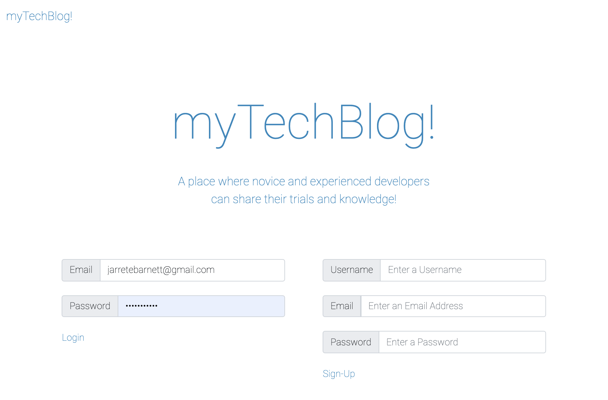
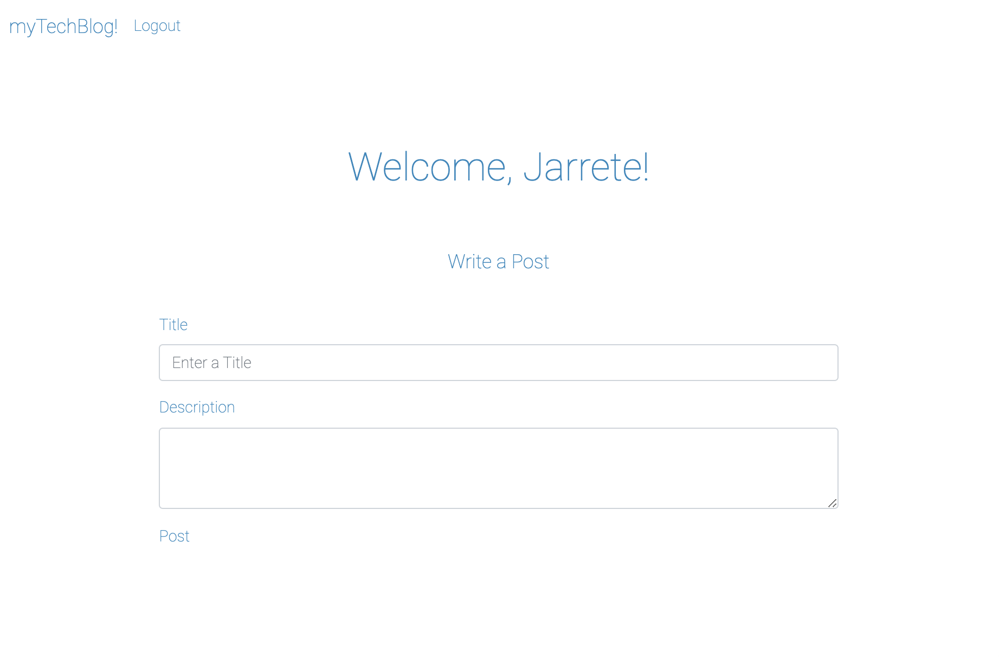

# Model-View-Controller (MVC): Tech Blog

## Table of Contents

* Description
* Installation
* Contributions
* Licensing
* Demo
* Questions

## Description

This is a deployed CMS-style blog site that features the ability to create accounts and post subjective forum material from users.

## Installation

It can either be cloned locally from the repository, or users can visit the deployed site at Heroku.

## Contributions

There are no other contributors to the project.

## Licensing

## Demo

Deployed application can be found here: https://techblogmvc.herokuapp.com/

## Questions

* You can follow my repositories at https://www.github.com/jarretebarnett
* For professional inquiries, you can email jarretebarnett@gmail.com